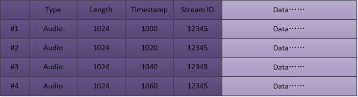
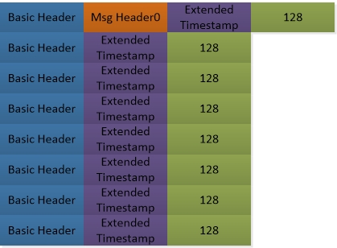
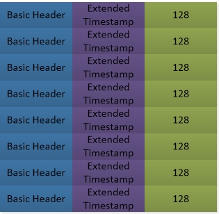

# RTMP Format

[TOC]


## 一：Message

Message为应用层的抽象，实际发送是将message 拆分为chunk发送。

```c++
 0               1               2               3
 0 1 2 3 4 5 6 7 0 1 2 3 4 5 6 7 0 1 2 3 4 5 6 7 0 1 2 3 4 5 6 7
+-+-+-+-+-+-+-+-+-+-+-+-+-+-+-+-+-+-+-+-+-+-+-+-+-+-+-+-+-+-+-+-+
| Message Type  |                Payload length                 |
|   (1 byte)    |                 (3 bytes)                     |
+-+-+-+-+-+-+-+-+-+-+-+-+-+-+-+-+-+-+-+-+-+-+-+-+-+-+-+-+-+-+-+-+
|                       Timestamp                               |
|                       (4 bytes)                               |
+-+-+-+-+-+-+-+-+-+-+-+-+-+-+-+-+-+-+-+-+-+-+-+-+-+-+-+-+-+-+-+-+
|                Stream ID                      |
|                (3 bytes)                      |
+-+-+-+-+-+-+-+-+-+-+-+-+-+-+-+-+-+-+-+-+-+-+-+-+
```

- Message Type：包类型，根据功能划分；
- Stream ID：Message通道，推流时请求建立后由服务器返回。

### 1.1 Protocol Control Messages

#### 1.1.1 Set Chunk Size(1)

默认大小为128 bytes。

```c++
 0               1               2               3
 0 1 2 3 4 5 6 7 0 1 2 3 4 5 6 7 0 1 2 3 4 5 6 7 0 1 2 3 4 5 6 7
+-+-+-+-+-+-+-+-+-+-+-+-+-+-+-+-+-+-+-+-+-+-+-+-+-+-+-+-+-+-+-+-+
|0|                     chunk size (31 bits)                    |
+-+-+-+-+-+-+-+-+-+-+-+-+-+-+-+-+-+-+-+-+-+-+-+-+-+-+-+-+-+-+-+-+
```

#### 1.1.2 Abort Message(2) 

```c++
 0               1               2               3
 0 1 2 3 4 5 6 7 0 1 2 3 4 5 6 7 0 1 2 3 4 5 6 7 0 1 2 3 4 5 6 7
+-+-+-+-+-+-+-+-+-+-+-+-+-+-+-+-+-+-+-+-+-+-+-+-+-+-+-+-+-+-+-+-+
|                       chunk stream id (32 bits)               |
+-+-+-+-+-+-+-+-+-+-+-+-+-+-+-+-+-+-+-+-+-+-+-+-+-+-+-+-+-+-+-+-+
```

#### 1.1.3 Acknowledgement(3)

```c++
 0               1               2               3
 0 1 2 3 4 5 6 7 0 1 2 3 4 5 6 7 0 1 2 3 4 5 6 7 0 1 2 3 4 5 6 7
+-+-+-+-+-+-+-+-+-+-+-+-+-+-+-+-+-+-+-+-+-+-+-+-+-+-+-+-+-+-+-+-+
|                        sequence number (4 bytes)              |
+-+-+-+-+-+-+-+-+-+-+-+-+-+-+-+-+-+-+-+-+-+-+-+-+-+-+-+-+-+-+-+-+
```

#### 1.1.4 Window Acknowledgement Size(5)

```c++
 0               1               2               3
 0 1 2 3 4 5 6 7 0 1 2 3 4 5 6 7 0 1 2 3 4 5 6 7 0 1 2 3 4 5 6 7
+-+-+-+-+-+-+-+-+-+-+-+-+-+-+-+-+-+-+-+-+-+-+-+-+-+-+-+-+-+-+-+-+
|                   Acknowledgement Window size (4 bytes)       |
+-+-+-+-+-+-+-+-+-+-+-+-+-+-+-+-+-+-+-+-+-+-+-+-+-+-+-+-+-+-+-+-+
```

#### 1.1.5 Set Peer Bandwidth(6)

```c++
 0               1               2               3
 0 1 2 3 4 5 6 7 0 1 2 3 4 5 6 7 0 1 2 3 4 5 6 7 0 1 2 3 4 5 6 7
+-+-+-+-+-+-+-+-+-+-+-+-+-+-+-+-+-+-+-+-+-+-+-+-+-+-+-+-+-+-+-+-+
|                   Acknowledgement Window size                 |
+-+-+-+-+-+-+-+-+-+-+-+-+-+-+-+-+-+-+-+-+-+-+-+-+-+-+-+-+-+-+-+-+
|  Limit Type   |
+-+-+-+-+-+-+-+-+
```

### 1.2 Command Messages

#### 1.2.1 User Control Messages (4)

message stream ID=0

chunk stream ID=2

```c++
+------------------------------+-------------------------
|     Event Type (16 bits)     | Event Data
+------------------------------+-------------------------
```

#### 1.2.2 Command Message (20, 17)

#### 1.2.3 Data Message (18, 15)

#### 1.2.4 Shared Object Message (19, 16)

#### 1.2.5 Audio Message (8)

#### 1.2.6 Video Message (9)

#### 1.2.7 Aggregate Message (22)


## 二：Chunk

```c++
+--------------+----------------+--------------------+--------------+
| Basic Header | Message Header | Extended Timestamp |  Chunk Data  |
+--------------+----------------+--------------------+--------------+
|                                                    |
|<------------------- Chunk Header ----------------->|
```

### 2.1 Basic Header

```c++
IDs: 2~63
 0 1 2 3 4 5 6 7
+-+-+-+-+-+-+-+-+
|fmt|   cs id   |
+-+-+-+-+-+-+-+-+

IDs: 64~319 (the second byte + 64)
 0               1
 0 1 2 3 4 5 6 7 0 1 2 3 4 5 6 7
+-+-+-+-+-+-+-+-+-+-+-+-+-+-+-+-+
|fmt|     0     |   cs id - 64  |
+-+-+-+-+-+-+-+-+-+-+-+-+-+-+-+-+

IDs: 64~65599 (((the third byte)*256 + (the second byte) + 64))
 0               1               2
 0 1 2 3 4 5 6 7 0 1 2 3 4 5 6 7 0 1 2 3 4 5 6 7
+-+-+-+-+-+-+-+-+-+-+-+-+-+-+-+-+-+-+-+-+-+-+-+-+
|fmt|     1     |        cs id - 64             |
+-+-+-+-+-+-+-+-+-+-+-+-+-+-+-+-+-+-+-+-+-+-+-+-+
```

- fmt - message header的四种类型之一；
- cs id - 表示范围 `3~65599`;
- `64~319` 可以使用2字节或3字节的头部表示。

### 2.2 Message Header

只有Type0的时间戳为绝对时间，其他类型的时间戳都为相对时间！

#### 2.2.1 Type0：11 bytes

```c++
 0               1               2               3
 0 1 2 3 4 5 6 7 0 1 2 3 4 5 6 7 0 1 2 3 4 5 6 7 0 1 2 3 4 5 6 7
+-+-+-+-+-+-+-+-+-+-+-+-+-+-+-+-+-+-+-+-+-+-+-+-+-+-+-+-+-+-+-+-+
|                   timestamp                   |message length |
+-+-+-+-+-+-+-+-+-+-+-+-+-+-+-+-+-+-+-+-+-+-+-+-+-+-+-+-+-+-+-+-+
|     message length (cont)     |message type id| msg stream id |
+-+-+-+-+-+-+-+-+-+-+-+-+-+-+-+-+-+-+-+-+-+-+-+-+-+-+-+-+-+-+-+-+
|           message stream id (cont)            |
+-+-+-+-+-+-+-+-+-+-+-+-+-+-+-+-+-+-+-+-+-+-+-+-+  
```

#### 2.2.2 Type1：7 bytes

```c++
 0               1               2               3
 0 1 2 3 4 5 6 7 0 1 2 3 4 5 6 7 0 1 2 3 4 5 6 7 0 1 2 3 4 5 6 7
+-+-+-+-+-+-+-+-+-+-+-+-+-+-+-+-+-+-+-+-+-+-+-+-+-+-+-+-+-+-+-+-+
|                timestamp delta                |message length |
+-+-+-+-+-+-+-+-+-+-+-+-+-+-+-+-+-+-+-+-+-+-+-+-+-+-+-+-+-+-+-+-+
|     message length (cont)     |message type id|
+-+-+-+-+-+-+-+-+-+-+-+-+-+-+-+-+-+-+-+-+-+-+-+-+
```

#### 2.2.3 Type2： 3 bytes

```c++
 0               1               2
 0 1 2 3 4 5 6 7 0 1 2 3 4 5 6 7 0 1 2 3 4 5 6 7
+-+-+-+-+-+-+-+-+-+-+-+-+-+-+-+-+-+-+-+-+-+-+-+-+
|                timestamp delta                |
+-+-+-+-+-+-+-+-+-+-+-+-+-+-+-+-+-+-+-+-+-+-+-+-+
```

#### 2.2.4 Type3：0 bytes

```c++
++
||
++
```

> timestamp >= 0xFFFFFF 时意味着使用扩展时间戳。

### 2.3 Extended Timestamp

当Message Header的时间戳为 0xFFFFFF 时使用扩展时间戳。4 bytes表示timestamp或timestamp delta。

```c++
 0               1               2               3
 0 1 2 3 4 5 6 7 0 1 2 3 4 5 6 7 0 1 2 3 4 5 6 7 0 1 2 3 4 5 6 7
+-+-+-+-+-+-+-+-+-+-+-+-+-+-+-+-+-+-+-+-+-+-+-+-+-+-+-+-+-+-+-+-+
|                      extended timestamp                       |
+-+-+-+-+-+-+-+-+-+-+-+-+-+-+-+-+-+-+-+-+-+-+-+-+-+-+-+-+-+-+-+-+
```

### 2.4 Example

#### 2.4.1 Audio Messages

例如有以下音频帧(Messages)需要发送：

```c++
+---------+-----------------+-----------------+-----------------+
|         |Message Stream ID| Message TYpe ID | Time  | Length  |
+---------+-----------------+-----------------+-------+---------+
| Msg # 1 |    12345        |         8       | 1000  |   32    |
+---------+-----------------+-----------------+-------+---------+
| Msg # 2 |    12345        |         8       | 1020  |   32    |
+---------+-----------------+-----------------+-------+---------+
| Msg # 3 |    12345        |         8       | 1040  |   32    |
+---------+-----------------+-----------------+-------+---------+
| Msg # 4 |    12345        |         8       | 1060  |   32    |
+---------+-----------------+-----------------+-------+---------+
```

因为都是音频帧，所以走的Stream ID和Message Type ID相同。每帧的时间间隔为20ms，每帧长度相等。使用Chunk类型优化，最终最优的发送方案为：

```c++
+--------+---------+-----+------------+------- ---+------------+
|        | Chunk   |Chunk|Header Data |No.of Bytes|Total No.of |
|        |Stream ID|Type |            |  After    |Bytes in the|
|        |         |     |            |Header     |Chunk       |
+--------+---------+-----+------------+-----------+------------+
|Chunk#1 |    3    |  0  | delta: 1000|   32      |    44      |
|        |         |     | length: 32,|           |            |
|        |         |     | type: 8,   |           |            |
|        |         |     | stream ID: |           |            |
|        |         |     | 12345 (11  |           |            |
|        |         |     | bytes)     |           |            |
+--------+---------+-----+------------+-----------+------------+
|Chunk#2 |    3    |  2  | 20 (3      |   32      |    36      |
|        |         |     | bytes)     |           |            |
+--------+---------+-----+----+-------+-----------+------------+
|Chunk#3 |    3    |  3  | none (0    |   32      |    33      |
|        |         |     | bytes)     |           |            |
+--------+---------+-----+------------+-----------+------------+
|Chunk#4 |    3    |  3  | none (0    |   32      |    33      |
|        |         |     | bytes)     |           |            |
+--------+---------+-----+------------+-----------+------------+
```

- 第一帧：因为没有上一帧，所以Chunk无法优化，使用Chunk Type1；
- 第二帧：和第一帧相比消息类型、数据长度等都相同，只有时间戳不同，所以可以采用Chunk Type2对帧优化，头部只需timestamp delta字段；
- 第三帧和第四帧：与上面帧相比，不单消息通道类型、数据长度等都相同，时间戳差值也都相同，为20，因此使用Chunk Type3，头部无需任何信息。

可见使用Chunk Type的优化还是很有效果的。

#### 2.4.2 Split Messages

当Chunk Size=128时，如果Message长度过长就需要分割为多个Chunk。如有以下Messages：

```c++
+-----------+-------------------+-----------------+-----------------+
|           | Message Stream ID | Message TYpe ID | Time  | Length  |
+-----------+-------------------+-----------------+-----------------+
| Msg # 1   |       12346       |    9 (video)    | 1000  |   307   |
+-----------+-------------------+-----------------+-----------------+
```

Message的长度为307 > 128，因此需要对Message进行分割：

```c++
+-------+------+-----+-------------+-----------+------------+
|       |Chunk |Chunk|Header       |No. of     |Total No. of|
|       |Stream| Type|Data         |Bytes after| bytes in   |
|       | ID   |     |             | Header    | the chunk  |
+-------+------+-----+-------------+-----------+------------+
|Chunk#1|  4   |  0  | delta: 1000 |  128      |   140      |
|       |      |     | length: 307 |           |            |
|       |      |     | type: 9,    |           |            |
|       |      |     | stream ID:  |           |            |
|       |      |     | 12346 (11   |           |            |
|       |      |     | bytes)      |           |            |
+-------+------+-----+-------------+-----------+------------+
|Chunk#2|  4   |  3  | none (0     |  128      |   129      |
|       |      |     | bytes)      |           |            |
+-------+------+-----+-------------+-----------+------------+
|Chunk#3|  4   |  3  | none (0     |  51       |   52       |
|       |      |     | bytes)      |           |            |
+-------+------+-----+-------------+-----------+------------+
```

307 = 128 + 128 + 51。

可见当Chunk Type3的上一帧为Chunk Type2或者Chunk Type1时表示timestamp delta相同进行的优化，而如果上一帧为Chunk Type0则表示同一帧的分割。(此处可继续优化)


## 三：Handshake

```c++
         +-------------+                           +-------------+
         |    Client   |       TCP/IP Network      |    Server   |
         +-------------+            |              +-------------+
               |                    |                     |
         Uninitialized              |               Uninitialized
               |          C0        |                     |
               |------------------->|         C0          |
               |                    |-------------------->|
               |          C1        |                     |
               |------------------->|         S0          |
               |                    |<--------------------|
               |                    |         S1          |
          Version sent              |<--------------------|
               |          S0        |                     |
               |<-------------------|                     |
               |          S1        |                     |
               |<-------------------|                Version sent
               |                    |         C1          |
               |                    |-------------------->|
               |          C2        |                     |
               |------------------->|         S2          |
               |                    |<--------------------|
            Ack sent                |                  Ack Sent
               |          S2        |                     |
               |<-------------------|                     |
               |                    |         C2          |
               |                    |-------------------->|
          Handshake Done            |               Handshake Done
               |                    |                     |
```

其实整个握手过程涉及两条握手线路，一条针对客户端，一条针对服务端。

客户端：

```c++
C1    ->    
      <-     S2            
```

服务端：

```c++
C0    ->     
      <-     S0/S1
C2    ->
```

### 3.1 C0和S0格式

```c++
 0 1 2 3 4 5 6 7
+-+-+-+-+-+-+-+-+
|   version     |
+-+-+-+-+-+-+-+-+
```

C0中version表示客户端请求的版本，S0的version表示server选择的版本。

`0~2`：废弃

`3`：当前使用版本

`4~31`：保留

`32~255`：禁止使用

### 3.2 C1和S1格式

1536 bytes。

```c++
 0               1               2               3
 0 1 2 3 4 5 6 7 0 1 2 3 4 5 6 7 0 1 2 3 4 5 6 7 0 1 2 3 4 5 6 7
+-+-+-+-+-+-+-+-+-+-+-+-+-+-+-+-+-+-+-+-+-+-+-+-+-+-+-+-+-+-+-+-+
|                        time (4 bytes)                         |
+-+-+-+-+-+-+-+-+-+-+-+-+-+-+-+-+-+-+-+-+-+-+-+-+-+-+-+-+-+-+-+-+
|                        zero (4 bytes)/FMS Version             |
+-+-+-+-+-+-+-+-+-+-+-+-+-+-+-+-+-+-+-+-+-+-+-+-+-+-+-+-+-+-+-+-+
|                        random bytes                           |
+-+-+-+-+-+-+-+-+-+-+-+-+-+-+-+-+-+-+-+-+-+-+-+-+-+-+-+-+-+-+-+-+
|                         random bytes                          |
|                            (cont)                             |
|                             ....                              |
+-+-+-+-+-+-+-+-+-+-+-+-+-+-+-+-+-+-+-+-+-+-+-+-+-+-+-+-+-+-+-+-+
```

### 3.3 C2和S2格式

1536 bytes，基本上是对C1和S1的回复。

```c++
 0               1               2               3
 0 1 2 3 4 5 6 7 0 1 2 3 4 5 6 7 0 1 2 3 4 5 6 7 0 1 2 3 4 5 6 7
+-+-+-+-+-+-+-+-+-+-+-+-+-+-+-+-+-+-+-+-+-+-+-+-+-+-+-+-+-+-+-+-+
|                        time (4 bytes)                         |
+-+-+-+-+-+-+-+-+-+-+-+-+-+-+-+-+-+-+-+-+-+-+-+-+-+-+-+-+-+-+-+-+
|                       time2 (4 bytes)                         |
+-+-+-+-+-+-+-+-+-+-+-+-+-+-+-+-+-+-+-+-+-+-+-+-+-+-+-+-+-+-+-+-+
|                        random echo                            |
+-+-+-+-+-+-+-+-+-+-+-+-+-+-+-+-+-+-+-+-+-+-+-+-+-+-+-+-+-+-+-+-+
|                         random echo                           |
|                            (cont)                             |
|                             ....                              |
+-+-+-+-+-+-+-+-+-+-+-+-+-+-+-+-+-+-+-+-+-+-+-+-+-+-+-+-+-+-+-+-+
```


## 四：Stream和Chunk的理解

Message Stream为创建的一条数据通道，可能有以下三种：

```c++
+-+-+-+-+-+-+-+-+-+-+-+-+-+-+-+-+-+-+-+-+-+-+-+-+-+-+-+-+-+-+-+-+
|                       视频/音频                                |
+-+-+-+-+-+-+-+-+-+-+-+-+-+-+-+-+-+-+-+-+-+-+-+-+-+-+-+-+-+-+-+-+

+-+-+-+-+-+-+-+-+-+-+-+-+-+-+-+-+-+-+-+-+-+-+-+-+-+-+-+-+-+-+-+-+
|                       只含视频                                 |
+-+-+-+-+-+-+-+-+-+-+-+-+-+-+-+-+-+-+-+-+-+-+-+-+-+-+-+-+-+-+-+-+

+-+-+-+-+-+-+-+-+-+-+-+-+-+-+-+-+-+-+-+-+-+-+-+-+-+-+-+-+-+-+-+-+
|                       只含音频                                 |
+-+-+-+-+-+-+-+-+-+-+-+-+-+-+-+-+-+-+-+-+-+-+-+-+-+-+-+-+-+-+-+-+
```

Message Stream由 `Message Stream ID` 唯一标识。创建Message Stream通道之后就可以在通道中发送Message，Message的类型由`Message Stream Type` 标识。RTMP模块在底层将对Message分割，分割的Chunk是真正发送的格式。

- `Chunk Type`优化 - 同一个Message分割内部或者连续发送的Message之间；

- `Chunk ID` - 同一个Message分割成的Chunks的 `Chunk ID` 相同；不同Message可以选择使用相同的`Chunk ID`。官方文档对ChunkID的使用描述很模糊，很大程度上会产生误导。其实，只要保证同一Message分割的Chunks的Chunk ID相同就可以了，这样服务器就可正确组包；此外，还要保证特定的Message使用特定的`Chunk ID`。

  常用的Chunk ID有：

  - 2： Protocol Control Messages (1,2,3,5,6) & User Control Messages Event (4)，Ping 和ByteRead通道 

  - 3： Invoke通道,这个通道适用的消息很多，比较灵活, connect, create_stream, release_stream, delete_stream, fcpublish, fcunpublish, publish, play, pause, seek, send_get_stream_length, 以及script脚本数据
  - 4：Audio和Vidio通道
  - 5 、6 、7：服务器保留,经观察FMS2用这些Channel也用来发送音频或视频数据。

  ```c++
  // https://github.com/ossrs/srs/blob/master/trunk/src/kernel/srs_kernel_flv.hpp
  /**
   * the chunk stream id used for some under-layer message,
   * for example, the PC(protocol control) message.
   */
  #define RTMP_CID_ProtocolControl                0x02
  /**
   * the AMF0/AMF3 command message, invoke method and return the result, over NetConnection.
   * generally use 0x03.
   */
  #define RTMP_CID_OverConnection                 0x03
  /**
   * the AMF0/AMF3 command message, invoke method and return the result, over NetConnection,
   * the midst state(we guess).
   * rarely used, e.g. onStatus(NetStream.Play.Reset).
   */
  #define RTMP_CID_OverConnection2                0x04
  /**
   * the stream message(amf0/amf3), over NetStream.
   * generally use 0x05.
   */
  #define RTMP_CID_OverStream                     0x05
  /**
   * the stream message(amf0/amf3), over NetStream, the midst state(we guess).
   * rarely used, e.g. play("mp4:mystram.f4v")
   */
  #define RTMP_CID_OverStream2                    0x08
  /**
   * the stream message(video), over NetStream
   * generally use 0x06.
   */
  #define RTMP_CID_Video                          0x06
  /**
   * the stream message(audio), over NetStream.
   * generally use 0x07.
   */
  #define RTMP_CID_Audio                          0x07
  ```

- $Message Stream ID=(Chunk ID - 4) / 5 + 1$。所以一般情况下 $Message Stream ID = 1$。


## 五：拆包和组包的完整示例

当ChunkSize=128时，考虑在Stream ID=12345的通道上传输长度为1024的四帧音频数据（音频的Type ID=8）：



### 5.1 无优化

当无忧化时，四帧采用相同的发送方式：



### 5.2 有优化

第一帧发送：


第二帧发送：


第三帧和第四帧发送：




